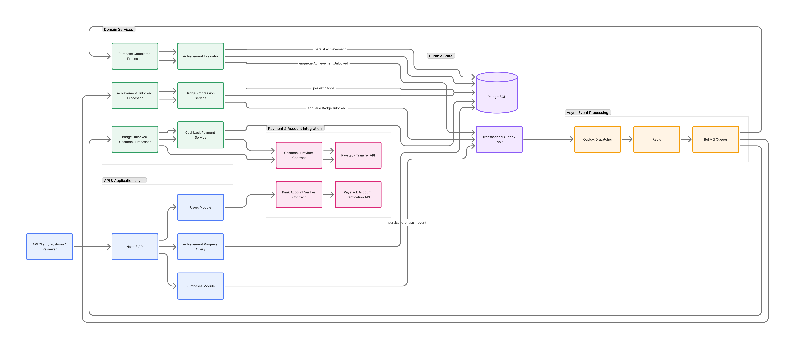

# Bumpa Ecommerce Store Assessment

NestJS backend for purchase-driven achievements, badge progression, and cashback processing.

The project demonstrates a small ecommerce reward system built around explicit domain state, durable asynchronous processing, and provider-independent payment boundaries.

Useful links:

- Architecture board: [Figma FigJam](https://www.figma.com/board/cQn3cc50T5KGtS4JaoFjCp/Bumpa-Senior-Backend-Assessment-%E2%80%94-Application-Architecture?node-id=0-1&t=uAB8Qw2vPyT3pAdU-1)
- Postman collection: [Bumpa Ecommerce Backend](https://www.postman.com/aggr-3550-r-22-s-team/workspace/bumpa-ecommerce-backend/collection/29245943-66345438-5182-4dff-9e9c-9efe5c8aecc7?action=share&source=copy-link&creator=29245943)
- Swagger docs: `http://localhost:{PORT}/docs`

## Quality Gates

The repository is set up so local checks and pull-request checks exercise the same core verification path.

Local commands:

```bash
npm run lint
npm run build
npm test
npm run test:integration
npm run migration:smoke
npm run audit:secrets
npm run audit:deps
```

Run the combined local gate:

```bash
npm run verify
```

Pre-push hook:

```bash
.husky/pre-push -> npm run verify
```

GitHub Actions runs on pull requests against `main`:

- `lint`
- `build`
- `test`
- `integration-test`
- `migrations`
- `secret-scan`
- `dependency-audit`

Security checks:

- Gitleaks scans for committed secrets.
- `npm audit --audit-level=high` blocks high-severity dependency findings.
- `.env.example` intentionally contains placeholders only.

Code quality checks:

- ESLint is configured to reject unused variables.
- DTOs use `class-validator`, `class-transformer`, and Swagger decorators.
- The app validates environment variables at startup.
- Integration tests boot the real Nest application against PostgreSQL, Redis, the transactional outbox, and BullMQ while faking only external Paystack calls.
- Migrations are smoke-tested against a disposable database.

## Quick Start With Docker

Build images:

```bash
docker compose build --pull
```

Run migrations:

```bash
docker compose --profile tools run --rm migrations
```

Start the API:

```bash
docker compose up app
```

The `app` service provisions the API process, embedded outbox dispatcher, BullMQ processors, PostgreSQL, and Redis. The API listens on `http://localhost:3000` by default.

Use a different host port:

```bash
HOST_PORT=8085 docker compose up app
```

Swagger docs are available at:

```text
http://localhost:{PORT}/docs
```

API routes are versioned under `/v1`, for example:

```text
GET http://localhost:{PORT}/v1/health
GET http://localhost:{PORT}/v1/users
POST http://localhost:{PORT}/v1/users/{userId}/purchases
GET http://localhost:{PORT}/v1/users/{userId}/achievements
```

Run tests in Docker:

```bash
docker compose --profile tools build tests
docker compose --profile tools run --rm tests
```

The explicit build keeps the test image in sync with local package scripts and test files after code changes. This runs both `npm test` and `npm run test:e2e` with PostgreSQL and Redis provisioned by Docker Compose.

Stop containers:

```bash
docker compose down
```

Reset the database volume:

```bash
docker compose down -v
```

An optional standalone worker service remains available for production-style process separation:

```bash
docker compose --profile workers up worker
```

## Local Setup

Install dependencies:

```bash
npm ci
```

Create a local `.env` from `.env.example`, then set at least:

```env
PAYSTACK_SECRET_KEY=your_paystack_test_secret
```

Start PostgreSQL and Redis locally, then run:

```bash
npm run migration:run
npm run start:dev
```

`npm run start:dev` starts the API and the async domain processors in the same Nest application process. A separate worker terminal is not required for normal local/demo usage.

Useful local commands:

```bash
npm run migration:show
npm run migration:revert
npm run test:integration
npm run test:watch
npm run test:cov
npm run start:worker
```

`test:integration` expects PostgreSQL and Redis to be reachable through the configured environment variables. Use `npm run docker:test` when you want Docker Compose to provision those services for you with a freshly built test image.

`start:worker` is retained for deployments that split API and background workers into separate processes. It is not required for local development because the dev application starts the background processors automatically.


## Environment Variables

| Variable                                  | Purpose                                                                     | Default                   |
| ----------------------------------------- | --------------------------------------------------------------------------- | ------------------------- |
| `NODE_ENV`                                | Runtime mode. Development enables the Paystack restricted-payout mock path. | `development`             |
| `PORT`                                    | Port the Nest app listens on inside the process/container.                  | `3000`                    |
| `LOG_LEVELS`                              | Comma-separated Nest log levels.                                            | `log,error,warn,debug`    |
| `DATABASE_HOST`                           | PostgreSQL host.                                                            | `localhost`               |
| `DATABASE_PORT`                           | PostgreSQL port.                                                            | `5432`                    |
| `DATABASE_USER`                           | Application database user.                                                  | `bumpa`                   |
| `DATABASE_PASSWORD`                       | Application database password.                                              | `bumpa`                   |
| `DATABASE_NAME`                           | Application database name.                                                  | `bumpa_ecommerce`         |
| `DATABASE_SCHEMA`                         | PostgreSQL schema used by TypeORM connections.                              | `public`                  |
| `DATABASE_SSL`                            | Enables PostgreSQL SSL.                                                     | `false`                   |
| `DATABASE_SYNCHRONIZE`                    | TypeORM synchronize flag. Keep `false` outside throwaway development.       | `false`                   |
| `REDIS_HOST`                              | Redis host for BullMQ.                                                      | `localhost`               |
| `REDIS_PORT`                              | Redis port for BullMQ.                                                      | `6379`                    |
| `BULLMQ_PREFIX`                           | Redis key prefix for BullMQ queues. Useful for isolating tests/workers.     | `bull`                    |
| `OUTBOX_POLL_INTERVAL_MS`                 | Outbox dispatcher poll interval.                                            | `1000`                    |
| `OUTBOX_BATCH_SIZE`                       | Max outbox rows claimed per dispatcher poll.                                | `25`                      |
| `CASHBACK_PROCESSING_STALE_AFTER_SECONDS` | Age after which an in-flight cashback claim can be retried.                 | `300`                     |
| `PROGRESSION_DEFINITION_LOADERS_ENABLED`  | Enables JSON definition loaders at startup.                                 | `true`                    |
| `PAYSTACK_BASE_URL`                       | Paystack API base URL.                                                      | `https://api.paystack.co` |
| `PAYSTACK_SECRET_KEY`                     | Paystack secret key. Required.                                              | none                      |
| `PAYSTACK_TRANSFER_SOURCE`                | Paystack transfer source.                                                   | `balance`                 |
| `PAYSTACK_CURRENCY`                       | Paystack transfer currency.                                                 | `NGN`                     |

## API Versioning

Routes are URI-versioned under `/v1`.

Examples:

```text
GET  /v1/health
GET  /v1/users
POST /v1/users
POST /v1/users/{userId}/purchases
GET  /v1/users/{userId}/achievements
```

Swagger remains available at:

```text
http://localhost:{PORT}/docs
```

## API Usage Walkthrough

The API is designed to let a reviewer exercise the full reward lifecycle with a small number of calls:

1. Create a user with bank details.
2. Use the returned user `id` to create completed purchases.
3. Poll the achievement progress endpoint after async processing runs.
4. Observe achievements, badges, and eventual cashback state in the database/logs.

All successful API responses use the same wrapper:

```json
{
  "status": true,
  "statusCode": 200,
  "message": "Human readable message",
  "data": {}
}
```

### 1. Create A User

`POST /v1/users` creates a user and verifies the supplied bank account details. The submitted `accountName` is not trusted as final payout state; Paystack account verification resolves and stores the verified account name.

```bash
curl -X POST http://localhost:3000/v1/users \
  -H 'Content-Type: application/json' \
  -d '{
    "email": "ada@example.com",
    "firstName": "Ada",
    "lastName": "Customer",
    "bankAccountDetails": {
      "accountNumber": "0123456789",
      "bankCode": "044",
      "accountName": "Ada Customer",
      "currency": "NGN"
    }
  }'
```

Keep the returned `data.id`; it is the `userId` used by purchase and progress routes.

Use correct bank details when possible, especially the provider bank code, because user creation verifies the account behind the scenes before persisting the user. Paystack exposes supported banks and their codes through its List Banks API:

```bash
curl 'https://api.paystack.co/bank?currency=NGN' \
  -H "Authorization: Bearer ${PAYSTACK_SECRET_KEY}" \
  -X GET
```

In Paystack test mode, live bank-account resolves may hit a daily limit after three successful resolves. If user creation fails with this Paystack response, use test bank code `001` for the demo request:

```json
{
  "message": "Test mode daily limit of 3 live bank resolves exceeded. Use test bank codes 001 or upgrade to live mode.",
  "error": "Bad Request",
  "statusCode": 400
}
```

To list existing users when manually testing:

```bash
curl http://localhost:3000/v1/users
```

### 2. Check The New User's Progress

`GET /v1/users/{userId}/achievements` returns the user's reward state. A brand-new user should have no unlocked achievements or badges, and should see the first available purchase achievement.

```bash
curl http://localhost:3000/v1/users/{userId}/achievements
```

Expected shape:

```json
{
  "status": true,
  "statusCode": 200,
  "message": "User achievement progress retrieved successfully",
  "data": {
    "unlockedAchievements": [],
    "nextAvailableAchievements": ["First Purchase"],
    "currentBadge": null,
    "nextBadge": "Starter",
    "remainingToUnlockNextBadge": 2
  }
}
```

### 3. Create Purchases

`POST /v1/users/{userId}/purchases` records a completed purchase. The request commits the purchase and a durable outbox event, then returns immediately. Achievement, badge, and cashback work happens asynchronously through the outbox dispatcher and BullMQ processors.

```bash
curl -X POST http://localhost:3000/v1/users/{userId}/purchases \
  -H 'Content-Type: application/json' \
  -d '{ "amount": 1200 }'
```

After one purchase, the async processors should unlock `First Purchase`. Poll the progress endpoint again:

```bash
curl http://localhost:3000/v1/users/{userId}/achievements
```

Expected progression after the first purchase:

```json
{
  "data": {
    "unlockedAchievements": ["First Purchase"],
    "nextAvailableAchievements": ["5 Purchases"],
    "currentBadge": null,
    "nextBadge": "Starter",
    "remainingToUnlockNextBadge": 1
  }
}
```

Create four more purchases to reach the `5 Purchases` achievement:

```bash
for i in 1 2 3 4; do
  curl -X POST http://localhost:3000/v1/users/{userId}/purchases \
    -H 'Content-Type: application/json' \
    -d '{ "amount": 1200 }'
done
```

Expected progression after five completed purchases:

```json
{
  "data": {
    "unlockedAchievements": ["First Purchase", "5 Purchases"],
    "nextAvailableAchievements": [],
    "currentBadge": "Starter",
    "nextBadge": "Loyal Customer",
    "remainingToUnlockNextBadge": 3
  }
}
```

### 4. Understand The Reward Rules

Current achievement definitions are loaded from `src/resources/achievement-definitions.json`:

| Achievement      | Group       | Unlock rule                    |
| ---------------- | ----------- | ------------------------------ |
| `First Purchase` | `purchases` | 1 completed purchase           |
| `5 Purchases`    | `purchases` | 5 completed purchases          |

Current badge definitions are loaded from `src/resources/badge-definitions.json`:

| Badge            | Unlock rule             |
| ---------------- | ----------------------- |
| `Starter`        | 2 unlocked achievements |
| `Loyal Customer` | 5 unlocked achievements |

The important distinction is that badges are based on unlocked achievement count, not purchase count. With the default definitions, a user earns `Starter` when `5 Purchases` unlocks because that is the user's second achievement.

### 5. Cashback Behavior

Unlocking a badge emits `badge.unlocked`, which triggers cashback processing asynchronously. The processor creates or reuses one cashback entitlement for the user/badge pair and attempts to send exactly `NGN 300`.

The purchase endpoint does not wait for Paystack. Check application logs for the outbox dispatcher, BullMQ processors, and cashback provider messages when manually testing. In the database, the result is stored in `cashback_payments` with status, provider reference, failure reason, and attempt count.

If Paystack rejects the transfer or the network fails, the badge remains unlocked and the cashback row remains auditable/retryable. A successful cashback is terminal and is never resent for the same badge.

### 6. API References

Swagger documents request/response schemas at:

```text
http://localhost:{PORT}/docs
```

The shared Postman collection is also available here:

```text
https://www.postman.com/aggr-3550-r-22-s-team/workspace/bumpa-ecommerce-backend/collection/29245943-66345438-5182-4dff-9e9c-9efe5c8aecc7?action=share&source=copy-link&creator=29245943
```

## Architecture

[](https://www.figma.com/board/cQn3cc50T5KGtS4JaoFjCp/Bumpa-Senior-Backend-Assessment-%E2%80%94-Application-Architecture?node-id=0-1&t=uAB8Qw2vPyT3pAdU-1)

The diagram above shows how API requests, domain services, durable storage, the transactional outbox, Redis/BullMQ workers, and Paystack integrations cooperate across the system.

## Event Flow

Purchase creation writes the purchase and a `purchase.completed` outbox event in one database transaction.

The outbox dispatcher later claims committed events and publishes them to BullMQ queues backed by Redis. The processors consume those jobs:

1. `purchase.completed` -> evaluate purchase achievements.
2. `achievement.unlocked` -> evaluate badge progression.
3. `badge.unlocked` -> resolve cashback entitlement and attempt payout.

There is no separate `cashback.*` outbox event today. Cashback processing is the consumer side effect of the `badge.unlocked` event.

## Achievement Progression

Achievement definitions live in `src/resources/achievement-definitions.json` and are loaded into the database at startup when `PROGRESSION_DEFINITION_LOADERS_ENABLED=true`.

The current purchase achievement group includes:

- `First Purchase`
- `5 Purchases`

An achievement group is a progression track for one metric. For purchase achievements, the metric is completed purchase count. If a user crosses several thresholds at once, every missing achievement up to the current progress is unlocked.

Duplicate achievement unlocks are prevented by:

- `user_achievements(user_id, achievement_id)` unique constraint
- insert-ignore behavior in the evaluator
- outbox events emitted only after a new unlock is persisted

## Badge Progression

Badge definitions live in `src/resources/badge-definitions.json` and are also loaded at startup when enabled.

Badges are based on unlocked achievement count, not raw purchase count. This is intentional: badge progression reacts to durable achievement state so it remains independent of how an achievement was earned.

When several badge thresholds are crossed at once, the service persists every missing eligible badge so badge history has no gaps. The highest newly unlocked badge is returned by the evaluator.

Duplicate badge unlocks are prevented by:

- `user_badges(user_id, badge_id)` unique constraint
- insert-ignore behavior in the progression service
- `badge.unlocked` emitted only after a new badge row is persisted

## Cashback Flow

Cashback is triggered by `badge.unlocked`.

The cashback processor:

1. Creates or reuses a cashback entitlement in `cashback_payments`.
2. Skips work if the payment already succeeded.
3. Atomically claims pending, failed, or stale-processing rows.
4. Sends exactly `NGN 300` through the configured cashback provider.
5. Persists provider outcome, provider reference, status, failure reason, and attempt count.

Payment records are persisted separately from provider communication so the system has an audit trail even when the provider fails or times out.

## Payment Provider Choice

Paystack is used as the local payment provider because it supports Nigerian bank account verification, transfer recipients, and transfers.

Business code depends on provider contracts:

- `BankAccountVerifier`
- `CashbackProvider`

Paystack-specific details stay inside `src/integrations/paystack`.

User creation verifies bank account details and stores the resolved account name. Paystack transfer recipient codes are provider-specific state and are created lazily during cashback processing, not during user creation.

In `NODE_ENV=development`, an exact Paystack restriction response for unverified businesses can be mocked as a successful transfer for demo purposes. Production and test behavior still use the normalized provider result.

## Transaction Boundaries

The core transaction boundaries are:

- Purchase row and `purchase.completed` outbox row are committed together.
- Achievement row and `achievement.unlocked` outbox row are committed together.
- Badge row and `badge.unlocked` outbox row are committed together.
- Cashback entitlement creation is separate from the external provider call.

External API calls are not made inside long database transactions. This avoids holding database locks while waiting on network I/O and keeps retries explicit.

## Idempotency Design

The system assumes at-least-once event delivery.

Safety comes from persisted idempotency boundaries:

- purchase side effects are driven by durable outbox events
- outbox rows are claimed with database status transitions
- BullMQ jobs use the outbox event id as the job id
- achievement and badge unlock tables have uniqueness constraints
- cashback entitlement is unique per user/badge
- cashback reference is deterministic: `cashback:{userId}:{badgeId}`
- successful cashback is never resent

The invariant to preserve is: every consumer must be safe to run more than once.

## Retry Behavior

Outbox dispatch retry:

- Failed dispatch marks the outbox row as `failed`.
- `next_attempt_at` is advanced with exponential backoff.
- Later polls can reclaim failed rows.

BullMQ retry:

- Jobs use retry attempts with exponential backoff.
- Completed and failed jobs are retained for inspection.

Cashback retry:

- Failed cashback rows can be claimed again.
- Processing rows older than `CASHBACK_PROCESSING_STALE_AFTER_SECONDS` are considered stale and retryable.
- Succeeded rows are terminal and skipped.

## Database Structure

Main tables:

- `users`: customer profile and verified bank-account fields
- `purchases`: completed purchase records
- `achievements`: persisted achievement definitions
- `user_achievements`: user unlock state
- `badges`: persisted badge definitions
- `user_badges`: user badge unlock state
- `cashback_payments`: auditable cashback entitlement and provider status
- `outbox_events`: durable event handoff table

Important constraints:

- unique user email
- unique achievement name
- unique achievement group/threshold
- unique badge name
- unique badge ordering
- unique user/achievement unlock
- unique user/badge unlock
- unique cashback user/badge entitlement
- unique cashback reference

## Production Hardening And Optimizations

The implementation is intentionally stronger than a simple in-process event emitter:

- transactional outbox prevents lost domain events after database commits
- Redis/BullMQ moves expensive work off the purchase request path
- embedded processors make local/demo startup simple
- optional standalone worker supports production-style process separation
- idempotent consumers support at-least-once delivery
- unique constraints enforce invariants under concurrency
- insert-ignore patterns avoid race-prone pre-checks
- stale processing cutoff supports crash recovery for cashback
- progress endpoint assembles query data from persisted state
- JSON definition loaders use advisory locks and upserts for concurrent startup safety
- structured Nest logs expose dispatcher, processor, provider, and domain activity
- Docker runtime uses a pinned Node Alpine image and production dependency install

## Ambiguous Requirement Interpretation

The assessment asks for `next_available_achievements`. This implementation returns one next achievement per achievement group, not every future achievement. That means a user sees the next actionable threshold for each progression track.

The API uses camelCase response fields across DTOs, interfaces, and response models even where the assessment text uses snake_case.

Badge progression is based on unlocked achievements, not purchase count. A user with four purchases has `First Purchase` but not `5 Purchases`, and therefore may not yet qualify for a badge unless the current badge threshold is satisfied by one unlocked achievement.

## Known Assumptions

- Purchases created through the demo endpoint are treated as completed purchases.
- Cashback amount is fixed at `NGN 300`.
- Paystack is the configured provider, but badge and cashback domain services depend on provider abstractions.
- The app requires Redis because BullMQ powers asynchronous processing.
- The app requires PostgreSQL because migrations, constraints, and transactional outbox behavior are central to correctness.
- Development mode may mock Paystack's third-party payout restriction to keep reviewer demos possible with an unverified Paystack business.
